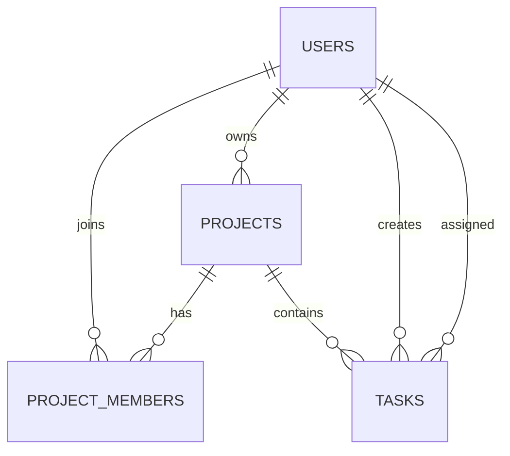

# Nexora

Enterprise Operations Management — uma central corporativa full stack para organizar operações, registros, responsáveis, prioridades e prazos.

## Produto

A Nexora foi desenhada como software interno de trabalho, não como um dashboard SaaS genérico. A experiência prioriza leitura rápida, tabelas densas e organizadas, filtros, rastreabilidade e eficiência operacional.

- Central de trabalho orientada a pendências
- Operações com progresso calculado
- Registros e solicitações em tabela corporativa
- Responsáveis, prioridades, status e prazos
- Pesquisa e filtros combináveis
- Autenticação JWT e isolamento de dados por usuário
- Interface responsiva com microinterações e estados de loading/error/empty

## Arquitetura

```text
Usuário → React/Vite → Express REST API → PostgreSQL (Neon)
```

O frontend e a API são serviços do mesmo projeto Vercel. O backend usa conexão PostgreSQL pooled, queries parametrizadas, validação com `express-validator`, senhas com bcrypt, rate limiting, Helmet e CORS restritivo.

## Modelo relacional



## Desenvolvimento

```bash
cd backend && npm install && npm run dev
cd frontend && npm install && npm run dev
```

Copie `backend/.env.example` para `backend/.env` e informe `DATABASE_URL` e `JWT_SECRET`. Credenciais nunca são versionadas.

## Stack

React 19, React Router, Vite, Lucide, Node.js, Express, PostgreSQL, JWT, bcrypt e Vercel.
